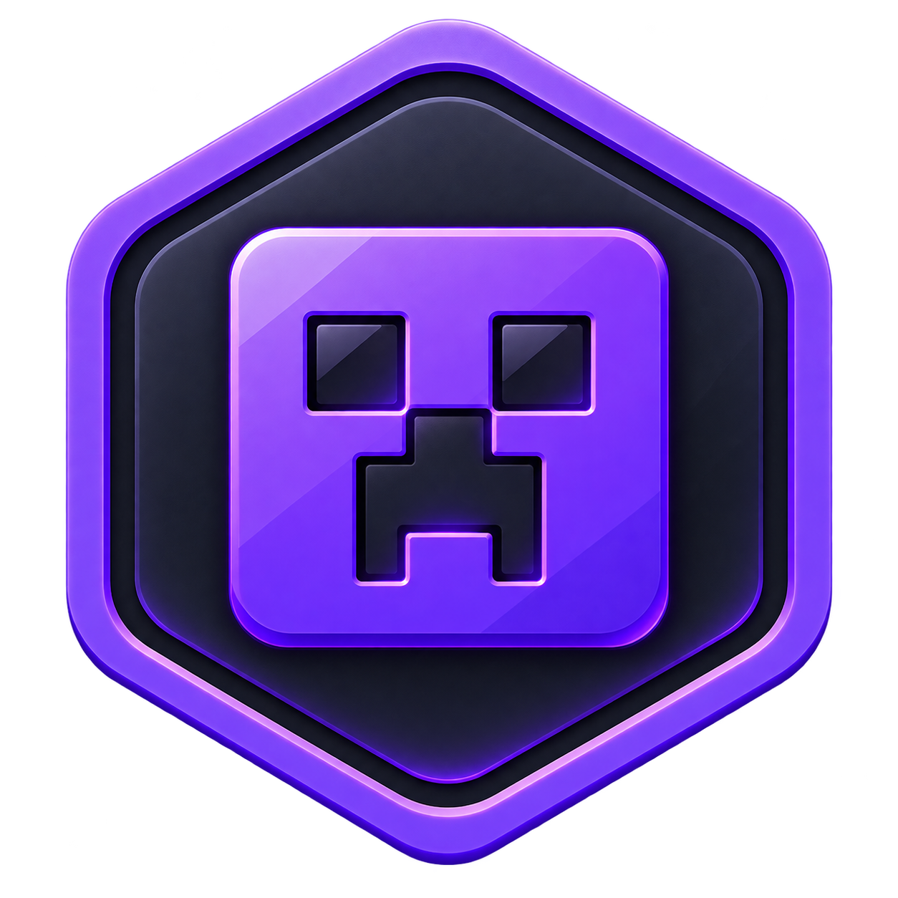

<p align="center">
  
</p>

<h1 align="center">Bedrock Nexus</h1>

<p align="center">
  A modern, free and open-source desktop launcher for <b>Minecraft Bedrock Edition (GDK)</b> on Windows.
</p>

<p align="center">
  <a href="https://github.com/BedrockNexusLauncher/BedrockNexusLauncher/actions/workflows/build.yml">
    
  </a>
  <a href="https://github.com/BedrockNexusLauncher/BedrockNexusLauncher/releases">
    
  </a>
  
  
</p>

---

## ✨ Features

- **Instance management** — install, isolate and run multiple Release and Preview builds side by side, each with its own content and settings.
- **One-click launch** — dependency checks and automatic setup for Microsoft Gaming Services, GameInput and the Visual C++ runtime before the game starts.
- **Content management** — import, organize, export and delete worlds, resource packs, behavior packs and skin packs; drag-and-drop `.mcpack`, `.mcaddon` and `.mcworld` files anywhere in the window.
- **Modding** — first-class [LeviLamina](https://github.com/LiteLDev/LeviLamina) support with per-instance installation, updates and version pinning, plus [lip](https://github.com/LiteLDev/lip) package browsing and management.
- **CurseForge integration** — search and install Bedrock mods directly from CurseForge.
- **Community marketplace** — browse and install packs from a GitHub-hosted community index.
- **World tools** — a built-in `level.dat` editor for world properties, and a per-version screenshot gallery.
- **Download manager** — resumable, throttled downloads with live progress for versions, mods and runtime dependencies.
- **Beautiful and personal** — light/dark themes, custom accent colors, wallpapers, optional themed strokes, and smooth animations with a disable-animations kill switch.
- **Truly multilingual** — 12 locales (English, 简体中文, 繁體中文, Русский, 日本語, Deutsch, Español, Français, Italiano, 한국어, Português, فارسی) with full right-to-left layout support for Persian.
- **Discord Rich Presence** — show what you're playing while the game runs.
- **Automatic updates** — the launcher keeps itself up to date from GitHub Releases.
- **Built-in diagnostics & bug reporting** — generate sanitized diagnostics reports and open pre-filled GitHub issues from inside the app.

## 📥 Downloads

Grab the latest installer from **[GitHub Releases](https://github.com/BedrockNexusLauncher/BedrockNexusLauncher/releases)**.

## 📋 Requirements

- Windows 10 or 11 (x64)
- A licensed copy of Minecraft Bedrock Edition (GDK) from the Microsoft Store
- Microsoft Gaming Services and Microsoft GameInput — the launcher checks for these and can set them up for you

## 📖 Documentation

- **English:** https://bedrocknexuslauncher.github.io/BedrockNexusLauncher/
- **简体中文:** https://bedrocknexuslauncher.github.io/BedrockNexusLauncher/zh-CN/

## 💬 Community

- **Discord:** https://discord.gg/v5R5P4vRZk
- **QQ Group:** https://qm.qq.com/q/1z791rJgJG

## 🐛 Reporting Issues

Found a bug or have a feature idea? Please [open an issue](https://github.com/BedrockNexusLauncher/BedrockNexusLauncher/issues).
The quickest way is **Settings → Report a Problem** (or **About → Report a Problem**) in the launcher — it attaches a sanitized diagnostics report automatically.

## 🛠️ Development

Bedrock Nexus is built with [Go](https://go.dev) + [Wails v3](https://v3alpha.wails.io) on the backend and React 19 + TypeScript + Tailwind CSS 4 + HeroUI on the frontend.

### Prerequisites

- [Go](https://go.dev/dl/) 1.25 or newer
- [Node.js](https://nodejs.org) 20 or newer (npm)
- [Wails v3 CLI](https://v3alpha.wails.io/reference/cli): `go install github.com/wailsapp/wails/v3/cmd/wails3@latest`
- [Task](https://taskfile.dev): `go install github.com/go-task/task/v3/cmd/task@latest`

### Run & build

```bash
# Install frontend dependencies
cd frontend && npm install && cd ..

# Start the app in development mode (hot reload)
wails3 task dev

# Production build
wails3 task build

# Package an installer (Inno Setup)
wails3 task package:inno

# Type-check and validate the frontend
wails3 task verify
```

### Documentation site

The user guide is a VitePress site in [`docs/`](docs/):

```bash
cd docs
npm install
npm run docs:dev
```

## 🤝 Contributing

Pull requests are welcome! For substantial changes, please open an issue first to discuss what you would like to change, and follow the existing code style (the backend is grouped under `internal/`, the frontend under `frontend/src/`).

## 📄 License

This project is licensed under the **LGPL-3.0** license for its non-closed-source parts — see [COPYING](COPYING) and [COPYING.LESSER](COPYING.LESSER) for details.

## ⚠️ Disclaimer

Bedrock Nexus is an unofficial community launcher and is not affiliated with, endorsed by, or associated with Mojang Studios or Microsoft. You must own a legitimate licensed copy of Minecraft Bedrock Edition to use it. "Minecraft" is a trademark of Mojang Studios.
